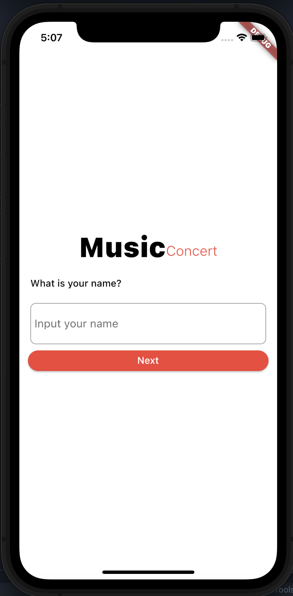
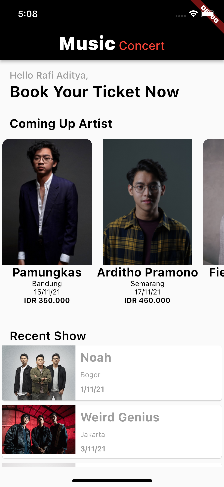
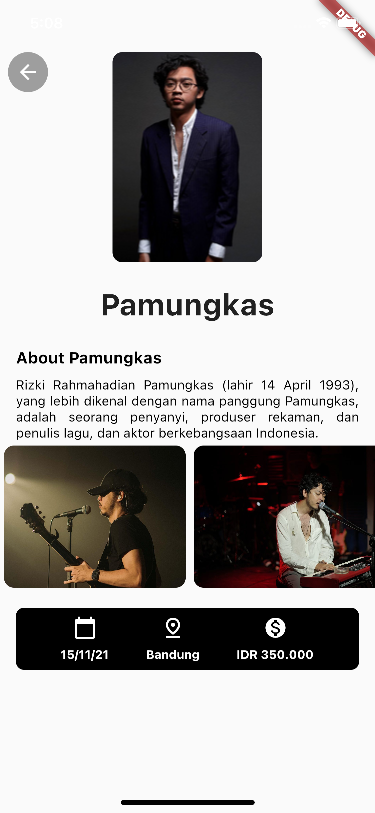

# Music Concert - Music Concert Application
> Sebuah aplikasi mobile yang dibangun dengan framework Flutter untuk memenuhi tugas pada kelas "Belajar Membuat Aplikasi Flutter untuk Pemula" dari Dicoding.

## Technologies Used
* Dart
* Flutter

## What I Learned
* Penggunaan widget untuk membuat tampilan aplikasi yang menarik

## Screen Captures
#### Login Page:

#### Home Page:

#### Details Page:

